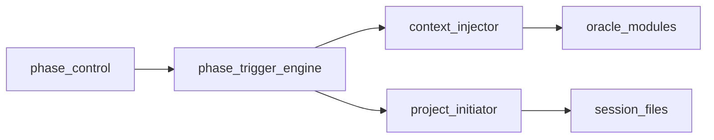

# Architecture Overview

```mermaid
graph LR
    phase_control --> phase_trigger_engine
    phase_trigger_engine --> context_injector
    phase_trigger_engine --> project_initiator
    context_injector --> oracle_modules
    project_initiator --> session_files
```

This diagram highlights the simplified flow when a new phase is selected.  The trigger engine launches several helpers which in turn manage session files and dashboards.
